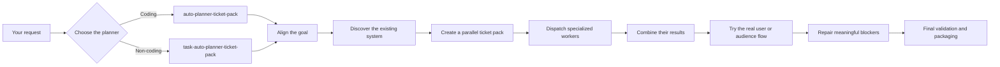

# Ticket Packs

Plan the whole outcome. Parallelize the work. Prove that it works.

Ticket Packs is an open collection of reusable skills for AI agents. It helps agents turn large or ambiguous requests into clear, coordinated work without creating unnecessary process.

The skills help an agent:

- understand the real goal;
- inspect the existing system before changing it;
- divide work into small, explicit tickets;
- run independent work in parallel;
- choose appropriate agents and tools;
- get an early version in front of the user;
- test the real user journey;
- repair only meaningful problems;
- package the smallest viable final change.

Ticket Packs is not a standalone agent or application. It is a skill web that adds planning, coordination, research, implementation, and validation practices to an agent that already knows how to use skills.

## Where do I start?

There are two main entry points:

| Your task | Entry skill |
|---|---|
| Coding, implementation, integration, or repository work | `auto-planner-ticket-pack` |
| Research, writing, analysis, data, or other non-coding work | `task-auto-planner-ticket-pack` |

Both planners use `goal-writing` to establish the complete outcome before breaking it into work.

You can also use `goal-writing` directly when several agents or projects need to agree on one shared goal before execution begins.

You do not need to select every supporting skill yourself. The planner should call them only when they are useful.

## How it works



The graph is intentionally non-linear. Independent work should happen in parallel and join only where its outputs are actually needed.

## How do I use it?

First, clone the repository:

```bash
git clone https://github.com/Bioscopics/ticket-packs.git
```

Then make the repository available through your agent’s normal skill-loading mechanism. Depending on the agent, that may mean adding the repository root to a recursive skill search path or copying or symlinking the skill folders you want to use. Keep the directory structure intact so entry skills can find their supporting skills and references.

Once installed, ask your agent naturally and name the appropriate entry skill.

### Coding example

```text
Use auto-planner-ticket-pack to add organization-level search to this
application. Reuse existing components and conventions, get the shortest real
user flow working early, and then finish and validate the implementation.
```

### Research or writing example

```text
Use task-auto-planner-ticket-pack to research our competitors and produce a
short decision memo with source-backed recommendations.
```

### Shared-goal example

```text
Use goal-writing to turn this conversation into one end-to-end goal for the
agents working across these repositories. Then hand it to the appropriate
planner.
```

If you only want a plan, say so. If you want the planner to dispatch workers and complete the work, ask it to execute the ticket pack.

## What is in a ticket pack?

A ticket pack normally contains:

```markdown
# Ticket Pack: <name>

## Summary
The exact outcome and why it matters.

## Public Interfaces
APIs, schemas, filenames, and artifact contracts.

## Proposed Flow
How the affected parts of the system work together.

## Lane Graph
A maximally parallel dependency graph.

## Tickets
Complete contracts for each worker lane.

## Assumptions
Important facts that have not yet been proven.
```

Each ticket explains what its worker owns, what it may change, what it must return, and what evidence proves the work is complete.

## Supporting skills

The planners can draw from supporting skills for:

- adaptive and deep research;
- coordinating existing agent tasks;
- dispatching Cursor agents and other specialists;
- minimizing code changes;
- testing through the real UI;
- probing agent behavior;
- reviewing PR boundaries;
- composing cohesive PR stacks;
- creating synthetic data and native test files;
- generating implementation-ready PRDs with `prd-generation`;
- finishing a repository change and preparing it for review with `repository-ship-it`;
- specialized workflows such as PDFs, frontend design, and citations.

These are building blocks, not additional steps that must run every time.

Names of external packages, distributions, and APIs remain exactly as their publishers define them, even when a name includes an organization string. That preserves interoperability; it does not make this catalog specific to that organization.

## Design principles

- Start with the whole outcome, not the first requested task.
- Prefer parallel work over long serial chains.
- Reuse existing components and conventions.
- Show the user something early, even if it exposes a failure.
- Test from the user’s entry point, not only from inside the code.
- Do not repeatedly verify facts that are already decision-sufficient.
- Spend additional effort where uncertainty or consequences justify it.
- Keep implementation and pull requests as small as honestly possible.
- Treat reviews as decision tools, not rituals.
- Finish only when the integrated result satisfies the original goal.

## License

[MIT](LICENSE)
