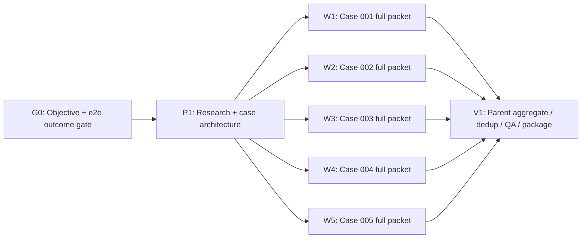

# Synthetic Data Scale

Use this reference for realistic case-folder generation, especially when the output will be used for UI/e2e testing, document ingestion, retrieval, extraction, or agent evaluation.

## Core Principle

Start from the e2e story and desired outcome, then generate a realistically sized packet for that story and scale class.

Do not generate a minimum packet by default. The corpus should include small, medium, large, and very large cases when the system needs to handle real-world variation.

For document-heavy cases, scale means a coherent packet family, not just total page count. A large case should look like accumulated records: long primary documents, short follow-up documents, structured exports, messages, scans, images, and noisy attachments that share IDs, dates, parties, and cross-references.

## Case Folder Contract

Each case folder owns one complete e2e story and all artifacts needed to test it:

```text
case_001_<short_slug>/
  e2e_story.md
  inputs/
    <native files uploaded to the app>
  expected/
    planted_facts.json
    expected_outcome.json
    reference_manifest.json
    ui_assertions.md
  metadata.json
```

Rules:

- `inputs/` contains only user-visible/uploaded artifacts.
- `expected/` contains tester-only labels, answers, planted-fact maps, and assertions; never upload these to the app.
- `e2e_story.md` describes the user journey, what the app should infer, and why this case exists.
- `reference_manifest.json` is required when held-out claims cite source artifacts; keep schema-independent PDF/workbook anchors there.
- `metadata.json` records scale class, document count, approximate page count, native file types, variant classes, intended imperfections, and source/eval routing.

## Scale Classes

Assign every case a scale class.

| Scale | Typical Shape | Purpose |
|---|---|---|
| `small` | 1-3 docs, 1-10 pages total | Smoke tests, clean happy paths, fast UI verification. |
| `medium` | 3-6 docs, 10-40 pages total | Normal operating cases and realistic day-to-day packets. |
| `large` | 6-12 docs, 40-150 pages total | Burdensome packets that test retrieval, extraction, dedup, and prioritization. |
| `very_large` | 12+ docs, 150+ pages or many records | Overloaded packets that test context pressure, batching, file handling, latency, and summarization. |

The generated corpus should usually include at least one case from multiple scale classes. If the user requests robustness, include all four.

## Shallow / Wide Task-Pack Shape

For most synthetic case-folder requests, use a compact graph:



Only add deeper serial lanes when the domain, source acquisition, or QA findings require it. The default should be one wave of independent case workers and one parent aggregation/validation pass.

## Case Worker Contract

Each case worker should generate a complete case folder, not isolated documents. The worker owns:

- the packet family map and shared fictional case timeline;
- the e2e story;
- all native input files for that case;
- hidden expected outcomes and planted-fact map;
- case metadata;
- a short generation note with limitations.

This keeps facts coherent across documents and lets each case target a specific user-visible output.

## Parent Aggregate / QA Pass

The parent or final packager performs one compact aggregate pass:

- deduplicate repeated phrasing and templates across cases;
- verify scale distribution;
- verify packet-family realism: files look related, accumulated over time, and internally cross-referenced;
- verify native files are real containers and not renamed text;
- verify long PDFs are not padded filler by rendering early/middle/late pages;
- verify clean, scanned, corrupt/partial, and extraction-hostile variants exist when required;
- verify planted facts are present in input docs;
- verify expected labels are outside inputs;
- verify each case maps to a distinct e2e outcome and UI assertion set;
- repair small packaging/metadata defects directly or request one targeted repair wave only for blockers.

## Prior-Authorization Example Case Mix

For a prior-auth corpus, a good first set might be:

- `case_001_small_clean_approval`: clean request, one policy criterion, obvious approval.
- `case_002_medium_missing_step_therapy`: missing prior medication history, needs more information.
- `case_003_large_contradictory_records`: clinical notes and medication sheet conflict.
- `case_004_large_scanned_packet`: scanned fax packet with poor OCR and embedded signatures/stamps.
- `case_005_very_large_appeal_packet`: long policy excerpt, multi-year history, denial letter, appeal narrative, labs, and duplicate/noisy attachments.

Each case should include real native files matching the scale target, not just short text summaries.
